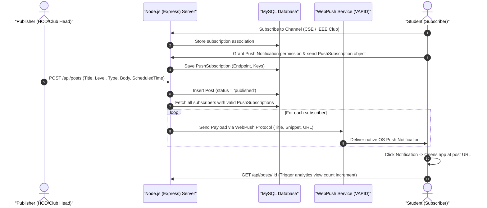
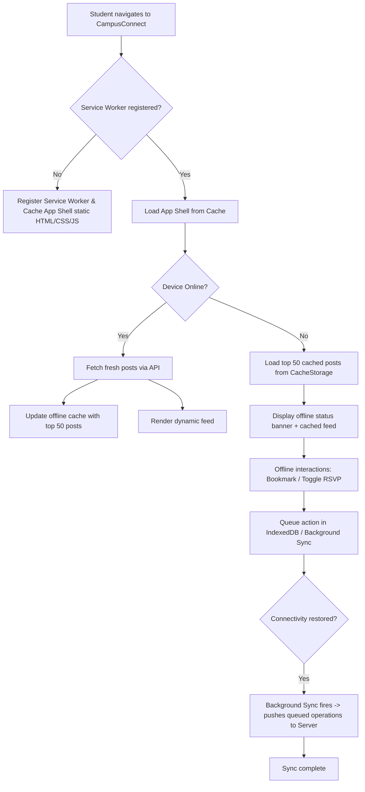
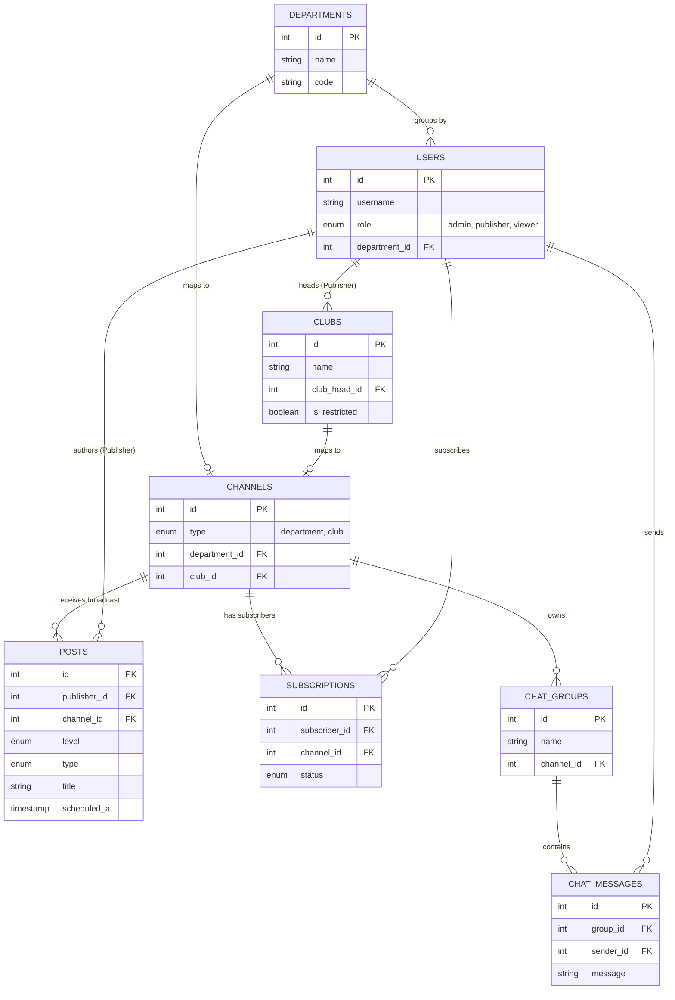
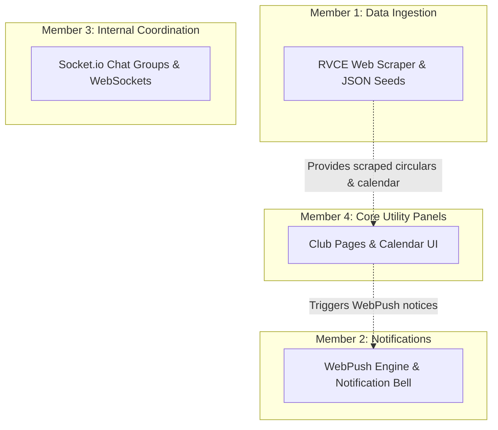

# CampusConnect — The RVCE Broadcast PWA
## Central Product Requirement Document (PRD)

> **STATUS UPDATE (June 2026):** Core backend, database schema, and authentication systems are **fully implemented**. Frontend UI development is **in progress**. Push notifications, offline sync, and advanced features are in the integration phase.

---

## 1. Executive Summary & Project Vision

### The Core Problem
At RV College of Engineering (RVCE), communication is fragmented. Critical updates, hackathon announcements, department circulars, placement drives, and club events are scattered across dozens of unofficial WhatsApp groups, email chains, and physical notice boards. A student in Computer Science (CSE) has no central channel to discover a seminar hosted by Electronics (ECE), a hackathon opened by the IEEE club, or a placement talk scheduled by the career cell, unless someone manually forwards a screenshot or text. This leads to information fatigue, missed opportunities, and administrative chaos.

### The Solution: CampusConnect
**CampusConnect** is a mobile-first Progressive Web App (PWA) that acts as the unified, official notice board for RVCE. 
Unlike WhatsApp or Telegram:
- **Role-Controlled Broadcast System:** Only authorized personnel (Super Admins, HODs, Faculty, Club Heads) can broadcast. Students have a read-only experience to eliminate clutter and maintain a high signal-to-noise ratio.
- **Granular Feeds & Discovery:** Students subscribe to specific "channels" (departments and clubs) and can filter their feeds by categories (hackathons, placement talks, seminars, exams, etc.) rather than drowning in unsorted chat lists.
- **PWA Capabilities:** The application installs directly onto a user's phone or desktop, operates offline utilizing Service Worker caching, and delivers native push notifications (even when the browser is closed).
- **Utility Integrations:** Combines broadcasts with an **academic calendar**, **placement section with RSVPs**, **moderation reporting**, and **private internal coordination groups** for club/department coordinators.

---

## 2. System Architecture & Flowcharts

The following diagrams illustrate the key operational flows of CampusConnect:

### A. Core Broadcast & Native Push Notification Flow


### B. Offline & Service Worker Sync Strategy


---

## 3. Implementation Status

### ✅ Completed Features

#### Backend & Database
- **Database Schema** — All 19 tables fully defined and implemented (MySQL 8):
  - Users, Departments, Clubs, Channels
  - Posts, Subscriptions, WebPush Subscriptions
  - Chat Groups & Messages, Bookmarks, Placement RSVPs
  - Academic Calendar, Notifications, Audit Logs, Reports
- **Authentication** — JWT-based login/register system with role-based access control
- **API Routes** — 8 route modules implemented:
  - `/api/auth` — Register, Login, User Profile
  - `/api/users` — User management, publisher listings
  - `/api/channels` — Channel listing, subscription management, subscriber approval
  - `/api/posts` — Feed retrieval, post creation, delete, like, bookmark
  - `/api/subscriptions` — User subscription management
  - `/api/admin` — Admin dashboard stats, user banning, role assignment
  - `/api/clubs` — Club listing and management
  - `/api/departments` — Department listing
- **Middleware** — Authentication and role-based authorization guards
- **File Uploads** — Multer integration for image/attachment uploads
- **Docker Support** — docker-compose.yml configured for local development

#### Frontend
- **PWA Setup** — Fully configured:
  - Service Worker for offline caching
  - Web App Manifest with icons (192px, 512px)
  - Installable on mobile and desktop
- **UI Framework** — Bootstrap 5 + Bootstrap Icons + custom CSS
- **Pages Implemented**:
  - Login page (index.html)
  - Main app shell (app.html) with responsive navigation
  - Feed with filtering by post type (events, hackathons, placements, notices)
  - Department/Channel selection
  - Offline fallback page
- **Frontend JS Modules**:
  - JWT-aware API wrapper (api.js)
  - Login controller (login.js)
  - Main app controller (app.js)
  - Service Worker registration (sw-register.js)

#### Security & Administration
- **Role-Based Access Control** — 3 roles: admin, publisher, viewer
- **Admin Dashboard** — View stats, manage users, approve publishers, ban users
- **Audit Logging** — Track administrative actions and role changes
- **Moderation** — Report management system infrastructure

### 🔄 In Progress / Partial Implementation

- **Push Notifications** — WebPush tables/schema ready; integration with service worker in progress
- **Chat System** — Database tables and routes defined; UI not yet implemented
- **Academic Calendar** — Database tables ready; UI integration pending
- **Analytics** — Post analytics table exists; tracking logic needs implementation
- **Advanced Filtering** — UI components for filtering by level (college-wide, dept, club) ready; full backend integration ongoing
- **Bookmarks & Preferences** — Backend tables exist; UI controls pending
- **Placement RSVPs** — Database schema ready; UI forms pending

### 📋 Planned / Not Yet Started

- **Real-time notifications** — Push notification delivery system
- **Background Sync** — Offline queue sync when connectivity restored
- **Rich text editing** — WYSIWYG editor for post composition
- **Image gallery** — Multi-image support in posts
- **Search functionality** — Full-text search implementation (MySQL FTS index prepared)
- **Stories feature** — Temporary content system (schema prepared)
- **Private messaging** — User-to-user direct messaging
- **User profiles** — Detailed user profile pages
- **Analytics dashboard** — Post engagement metrics visualization
- **Notification preferences** — Granular notification control UI

---

## 4. Database Schema Design (MySQL)

This schema is optimized for **MySQL 8** (InnoDB engine), which is currently implemented in the database booster (`db.js` and `server.js`). It expands the existing schema to accommodate all requested features while keeping the system manageable for a student.

### ER Schema Diagram



### Table Definitions

```sql
-- Create database if not exists
CREATE DATABASE IF NOT EXISTS campus_connect
  CHARACTER SET utf8mb4
  COLLATE utf8mb4_unicode_ci;

USE campus_connect;

-- 1. Departments Table
CREATE TABLE IF NOT EXISTS departments (
  id INT AUTO_INCREMENT PRIMARY KEY,
  name VARCHAR(100) UNIQUE NOT NULL,
  code VARCHAR(10) UNIQUE NOT NULL, -- e.g., 'CSE', 'ECE', 'ME'
  created_at TIMESTAMP DEFAULT CURRENT_TIMESTAMP
) ENGINE=InnoDB;

-- 2. Users Table
-- Supports 3 Roles: 'admin' (global), 'publisher' (faculty/club leads), 'viewer' (student)
CREATE TABLE IF NOT EXISTS users (
  id INT AUTO_INCREMENT PRIMARY KEY,
  username VARCHAR(100) UNIQUE NOT NULL, -- e.g., student USN or admin email
  password_hash VARCHAR(255) NOT NULL,
  full_name VARCHAR(150) NOT NULL,
  role ENUM('admin', 'publisher', 'viewer') NOT NULL,
  department_id INT NULL,
  phone_number VARCHAR(15) NULL,
  email VARCHAR(150) UNIQUE NOT NULL,
  is_active BOOLEAN DEFAULT TRUE,
  created_at TIMESTAMP DEFAULT CURRENT_TIMESTAMP,
  FOREIGN KEY (department_id) REFERENCES departments(id) ON DELETE SET NULL
) ENGINE=InnoDB;

-- 3. Clubs Table
CREATE TABLE IF NOT EXISTS clubs (
  id INT AUTO_INCREMENT PRIMARY KEY,
  name VARCHAR(100) UNIQUE NOT NULL,
  code VARCHAR(15) UNIQUE NOT NULL, -- e.g., 'IEEE', 'CODS', 'CHIRAAG'
  description TEXT NULL,
  logo_url VARCHAR(255) NULL,
  club_head_id INT NOT NULL,
  department_id INT NULL, -- optional departmental affiliation
  is_restricted BOOLEAN DEFAULT FALSE, -- restricted clubs require approval to subscribe
  is_active BOOLEAN DEFAULT TRUE,
  created_at TIMESTAMP DEFAULT CURRENT_TIMESTAMP,
  FOREIGN KEY (club_head_id) REFERENCES users(id) ON DELETE RESTRICT,
  FOREIGN KEY (department_id) REFERENCES departments(id) ON DELETE SET NULL
) ENGINE=InnoDB;

-- 4. Channels Table (Unified subscription target)
-- Students subscribe to CHANNELS, which represent either a Department or a Club.
CREATE TABLE IF NOT EXISTS channels (
  id INT AUTO_INCREMENT PRIMARY KEY,
  type ENUM('department', 'club') NOT NULL,
  department_id INT NULL UNIQUE,
  club_id INT NULL UNIQUE,
  name VARCHAR(150) NOT NULL,
  description TEXT NULL,
  created_at TIMESTAMP DEFAULT CURRENT_TIMESTAMP,
  FOREIGN KEY (department_id) REFERENCES departments(id) ON DELETE CASCADE,
  FOREIGN KEY (club_id) REFERENCES clubs(id) ON DELETE CASCADE,
  CONSTRAINT chk_channel_type CHECK (
    (type = 'department' AND department_id IS NOT NULL AND club_id IS NULL) OR
    (type = 'club' AND club_id IS NOT NULL AND department_id IS NULL)
  )
) ENGINE=InnoDB;

-- 5. Subscriptions Table
CREATE TABLE IF NOT EXISTS subscriptions (
  id INT AUTO_INCREMENT PRIMARY KEY,
  subscriber_id INT NOT NULL,
  channel_id INT NOT NULL,
  status ENUM('pending', 'approved') NOT NULL DEFAULT 'approved', -- 'pending' is used for restricted clubs
  created_at TIMESTAMP DEFAULT CURRENT_TIMESTAMP,
  UNIQUE KEY uniq_sub (subscriber_id, channel_id),
  FOREIGN KEY (subscriber_id) REFERENCES users(id) ON DELETE CASCADE,
  FOREIGN KEY (channel_id) REFERENCES channels(id) ON DELETE CASCADE
) ENGINE=InnoDB;

-- 6. Posts Table
-- Every post belongs to a channel (department/club) or is globally broadcasted by super_admin
CREATE TABLE IF NOT EXISTS posts (
  id INT AUTO_INCREMENT PRIMARY KEY,
  publisher_id INT NOT NULL,
  channel_id INT NULL, -- NULL means a college-wide broadcast by super_admin
  title VARCHAR(200) NOT NULL,
  body TEXT NOT NULL, -- Rich text body / HTML support
  level ENUM('college_wide', 'department', 'club', 'student_body') NOT NULL,
  type ENUM('meeting', 'event', 'hackathon', 'conference', 'seminar', 'workshop', 'placement_talk', 'circular') NOT NULL,
  attachment_url VARCHAR(255) NULL, -- PDF flyer / image attachments
  is_pinned BOOLEAN DEFAULT FALSE, -- Pin to top of feed (super_admin only)
  scheduled_at TIMESTAMP NULL DEFAULT CURRENT_TIMESTAMP, -- Future drafting support
  expires_at TIMESTAMP NULL, -- Automatic archiving
  is_published BOOLEAN DEFAULT TRUE,
  created_at TIMESTAMP DEFAULT CURRENT_TIMESTAMP,
  FOREIGN KEY (publisher_id) REFERENCES users(id) ON DELETE CASCADE,
  FOREIGN KEY (channel_id) REFERENCES channels(id) ON DELETE CASCADE,
  -- Optimized indexes for fast feeds & searches
  INDEX idx_publish_time (is_published, scheduled_at, expires_at),
  FULLTEXT INDEX idx_search (title, body) -- MySQL InnoDB Full-text search
) ENGINE=InnoDB;

-- 7. WebPush Subscriptions Table
-- Holds active push endpoints for service worker delivery
CREATE TABLE IF NOT EXISTS push_subscriptions (
  id INT AUTO_INCREMENT PRIMARY KEY,
  user_id INT NOT NULL,
  endpoint TEXT NOT NULL,
  p256dh VARCHAR(255) NOT NULL,
  auth VARCHAR(255) NOT NULL,
  user_agent VARCHAR(255) NULL,
  created_at TIMESTAMP DEFAULT CURRENT_TIMESTAMP,
  UNIQUE KEY uniq_endpoint (user_id, endpoint(255)),
  FOREIGN KEY (user_id) REFERENCES users(id) ON DELETE CASCADE
) ENGINE=InnoDB;

-- 8. User Preferences (Notification filtering)
CREATE TABLE IF NOT EXISTS notification_preferences (
  id INT AUTO_INCREMENT PRIMARY KEY,
  user_id INT UNIQUE NOT NULL,
  mute_meetings BOOLEAN DEFAULT FALSE,
  mute_circulars BOOLEAN DEFAULT FALSE,
  mute_placements BOOLEAN DEFAULT FALSE,
  mute_hackathons BOOLEAN DEFAULT FALSE,
  daily_digest BOOLEAN DEFAULT FALSE,
  created_at TIMESTAMP DEFAULT CURRENT_TIMESTAMP,
  FOREIGN KEY (user_id) REFERENCES users(id) ON DELETE CASCADE
) ENGINE=InnoDB;

-- 9. In-App Notifications Table
CREATE TABLE IF NOT EXISTS notifications (
  id INT AUTO_INCREMENT PRIMARY KEY,
  user_id INT NOT NULL,
  post_id INT NOT NULL,
  is_read BOOLEAN DEFAULT FALSE,
  created_at TIMESTAMP DEFAULT CURRENT_TIMESTAMP,
  FOREIGN KEY (user_id) REFERENCES users(id) ON DELETE CASCADE,
  FOREIGN KEY (post_id) REFERENCES posts(id) ON DELETE CASCADE
) ENGINE=InnoDB;

-- 10. Bookmarks Table
CREATE TABLE IF NOT EXISTS bookmarks (
  id INT AUTO_INCREMENT PRIMARY KEY,
  user_id INT NOT NULL,
  post_id INT NOT NULL,
  created_at TIMESTAMP DEFAULT CURRENT_TIMESTAMP,
  UNIQUE KEY uniq_bookmark (user_id, post_id),
  FOREIGN KEY (user_id) REFERENCES users(id) ON DELETE CASCADE,
  FOREIGN KEY (post_id) REFERENCES posts(id) ON DELETE CASCADE
) ENGINE=InnoDB;

-- 11. Placement RSVPs Table
CREATE TABLE IF NOT EXISTS placement_rsvps (
  id INT AUTO_INCREMENT PRIMARY KEY,
  post_id INT NOT NULL,
  student_id INT NOT NULL,
  created_at TIMESTAMP DEFAULT CURRENT_TIMESTAMP,
  UNIQUE KEY uniq_rsvp (post_id, student_id),
  FOREIGN KEY (post_id) REFERENCES posts(id) ON DELETE CASCADE,
  FOREIGN KEY (student_id) REFERENCES users(id) ON DELETE CASCADE
) ENGINE=InnoDB;

-- 12. Post Analytics Table
CREATE TABLE IF NOT EXISTS post_analytics (
  post_id INT PRIMARY KEY,
  notifications_sent INT DEFAULT 0,
  notifications_opened INT DEFAULT 0,
  unique_views INT DEFAULT 0,
  FOREIGN KEY (post_id) REFERENCES posts(id) ON DELETE CASCADE
) ENGINE=InnoDB;

-- 13. Academic Calendar Events Table
CREATE TABLE IF NOT EXISTS academic_calendar (
  id INT AUTO_INCREMENT PRIMARY KEY,
  title VARCHAR(150) NOT NULL,
  description TEXT NULL,
  event_date DATE NOT NULL,
  event_type ENUM('exam', 'holiday', 'semester_start', 'semester_end', 'college_event') NOT NULL,
  created_by INT NOT NULL,
  created_at TIMESTAMP DEFAULT CURRENT_TIMESTAMP,
  FOREIGN KEY (created_by) REFERENCES users(id) ON DELETE RESTRICT
) ENGINE=InnoDB;

-- 14. Posts Linked to Calendar Table
CREATE TABLE IF NOT EXISTS post_calendar_links (
  post_id INT NOT NULL,
  calendar_event_id INT NOT NULL,
  PRIMARY KEY (post_id, calendar_event_id),
  FOREIGN KEY (post_id) REFERENCES posts(id) ON DELETE CASCADE,
  FOREIGN KEY (calendar_event_id) REFERENCES academic_calendar(id) ON DELETE CASCADE
) ENGINE=InnoDB;

-- 15. Private Chat Groups Table
CREATE TABLE IF NOT EXISTS chat_groups (
  id INT AUTO_INCREMENT PRIMARY KEY,
  name VARCHAR(100) NOT NULL,
  description TEXT NULL,
  channel_id INT NULL, -- association with a club or department
  created_by INT NOT NULL,
  created_at TIMESTAMP DEFAULT CURRENT_TIMESTAMP,
  FOREIGN KEY (channel_id) REFERENCES channels(id) ON DELETE CASCADE,
  FOREIGN KEY (created_by) REFERENCES users(id) ON DELETE RESTRICT
) ENGINE=InnoDB;

-- 16. Chat Group Members Table
CREATE TABLE IF NOT EXISTS chat_group_members (
  id INT AUTO_INCREMENT PRIMARY KEY,
  group_id INT NOT NULL,
  user_id INT NOT NULL,
  role ENUM('admin', 'member') NOT NULL DEFAULT 'member',
  joined_at TIMESTAMP DEFAULT CURRENT_TIMESTAMP,
  UNIQUE KEY uniq_member (group_id, user_id),
  FOREIGN KEY (group_id) REFERENCES chat_groups(id) ON DELETE CASCADE,
  FOREIGN KEY (user_id) REFERENCES users(id) ON DELETE CASCADE
) ENGINE=InnoDB;

-- 17. Chat Messages Table
CREATE TABLE IF NOT EXISTS chat_messages (
  id INT AUTO_INCREMENT PRIMARY KEY,
  group_id INT NOT NULL,
  sender_id INT NOT NULL,
  message TEXT NOT NULL,
  created_at TIMESTAMP DEFAULT CURRENT_TIMESTAMP,
  FOREIGN KEY (group_id) REFERENCES chat_groups(id) ON DELETE CASCADE,
  FOREIGN KEY (sender_id) REFERENCES users(id) ON DELETE CASCADE
) ENGINE=InnoDB;

-- 18. Audit Logs Table (For moderation & tracking)
CREATE TABLE IF NOT EXISTS audit_logs (
  id INT AUTO_INCREMENT PRIMARY KEY,
  actor_id INT NOT NULL,
  action VARCHAR(100) NOT NULL, -- e.g., 'ROLE_CHANGE', 'POST_DELETE', 'USER_BAN', 'IMPERSONATION'
  details TEXT NOT NULL, -- JSON formatted details of changes
  created_at TIMESTAMP DEFAULT CURRENT_TIMESTAMP,
  FOREIGN KEY (actor_id) REFERENCES users(id) ON DELETE CASCADE
) ENGINE=InnoDB;

-- 19. Reports Table
CREATE TABLE IF NOT EXISTS reports (
  id INT AUTO_INCREMENT PRIMARY KEY,
  reporter_id INT NOT NULL,
  post_id INT NOT NULL,
  reason VARCHAR(255) NOT NULL,
  status ENUM('pending', 'reviewed', 'ignored') NOT NULL DEFAULT 'pending',
  created_at TIMESTAMP DEFAULT CURRENT_TIMESTAMP,
  FOREIGN KEY (reporter_id) REFERENCES users(id) ON DELETE CASCADE,
  FOREIGN KEY (post_id) REFERENCES posts(id) ON DELETE CASCADE
) ENGINE=InnoDB;
```

---

## 4. Roles & Permissions Matrix

CampusConnect uses a streamlined 3-tier architecture. "Publisher" encompasses Faculty, HODs, and Student Club Leads. Publishers derive their specific permissions based on which department or club they are assigned to in the database.

| Feature Area / Capability | Admin | Publisher (Faculty / Club Leads) | Viewer (Student) |
|:---|:---:|:---:|:---:|
| **College-wide Broadcasts** | ✅ Yes (Create/Pin/Edit) | ✅ Yes | ❌ Read Only |
| **Department & Club Broadcasts** | ✅ Yes | ✅ Yes (Only to assigned channels) | ❌ Read Only |
| **Subscription Requests Approval** | ✅ Yes | ✅ Yes (For their assigned restricted clubs) | ❌ No |
| **User Management (Role Assign/Banning)** | ✅ Yes | ❌ No | ❌ No |
| **Audit Logs Access** | ✅ Yes | ❌ No | ❌ No |
| **Impersonate Users** | ✅ Yes (Logged) | ❌ No | ❌ No |
| **Academic Calendar (Modify)** | ✅ Yes | ❌ No | ❌ No |
| **Placement RSVPs Analytics** | ❌ N/A (Future Feature) | ❌ N/A (Future Feature) | ❌ N/A (Future Feature) |
| **Internal Coord. Groups (Socket.io)** | ✅ Yes | ✅ Yes | ❌ No (Unless added) |
| **Feed Customization & Mute Prefs** | ❌ N/A | ❌ N/A | ✅ Yes |

---

## 5. Detailed Feature Specifications

### 1. Broadcast Feed & Composer
- **Post Composer (Rich Text):** Allows formatting such as headings, bold, lists, embedded hyperlinks (Google Meet, RSVPs), and attachment file paths (compressed flyers or PDFs).
- **Post Metadata:** Authors must define **Level** (college-wide, department, club, student body) and **Type** (meeting, event, hackathon, conference, seminar, workshop, placement talk, circular).
- **Scheduling Drawer:** Incorporates a draft status with a `scheduled_at` timestamp. A worker or query condition on the server hides posts where `scheduled_at > NOW()`.
- **Auto-Archive (Expiry):** Posts include an `expires_at` date. Archived posts do not appear on standard student feeds but remain searchable for historical records.
- **Pinned Posts:** A designated `is_pinned` BOOLEAN allows the Super Admin to snap highly critical circulars to the top of everyone's feed, regardless of channel subscriptions.

### 2. Native PWA Push Notification System (WebPush)
- **VAPID Keys Configuration:** Integrates Node.js `web-push` library. Public key exposed to the client to initialize browser push subscription.
- **Service Worker Integration:** Client-side registers `push` and `notificationclick` listeners inside `/public/service-worker.js` to process incoming JSON payloads and launch the app shell on active posts.
- **In-App Notification Center:** A notifications list with an unread badge inside the app header. Includes granular options to "Dismiss" or "Mark All as Read".
- **Student Mute Preferences:** Students can specify their notification preferences in a dedicated settings menu. This excludes muted types (e.g. "Mute routine meetings from ECE") during the push-dispatch fanout.
- **Daily Digest Cron:** A scheduler batches notifications marked as "Low Priority" into a single, comprehensive text summary dispatched at 8 PM daily, reducing notification spam.

### 3. PWA Offline Core & Local Sync
- **Service Worker Offline Cache:** The app shell (Bootstrap files, JS, styles.css, custom SVGs/icons) caches immediately upon installation.
- **Feed Cache Strategy (Network-First with Cache Fallback):** The API request `/api/posts` dynamically caches the response. If network requests fail (e.g. college Wi-Fi deadzones), the service worker returns the stored 50 posts from cache storage instantly, notifying the student with an offline alert banner.
- **Background Synchronization:** Actions like "Save Bookmark" or "Subscribe" taken while offline are stored inside a local IndexedDB buffer. The Service Worker uses `sync` API events to execute background queues as soon as internet connection is restored.
- **Custom Native Install Prompt:** Captures the `beforeinstallprompt` event and presents a beautiful, stylized in-app modal urging installation on the second page view, custom-styled in the RVCE visual theme (Royal Gold and Emerald Green).

### 4. Interactive Student Feed & Discovery (Explore)
- **Chronological Primary Feed:** Displays posts from channels (departments/clubs) the student follows.
- **Explore Feed:** Exhibits posts from channels the student has **not** subscribed to, allowing discovery of events outside their primary field.
- **Filters & Search:** Includes filters for department, date ranges, and categories. Includes full-text keyword search across post contents.
  > [!TIP]
  > Since the database is built on **MySQL**, search queries utilize MySQL's native `FULLTEXT` search syntax:
  > `SELECT * FROM posts WHERE MATCH(title, body) AGAINST(? IN NATURAL LANGUAGE MODE)`
  > This is highly performant at college-scale, requires zero infrastructure changes, and remains fully manageable for a student.

### 5. Private Groups & Real-Time Chat (Socket.io)
- **Internal Coordination Rooms:** Real-time messaging tailored specifically for internal department or club coordinator panels.
- **WebSocket Gateway:** Integrates `Socket.io` into `server.js` using authentication cookies to identify senders.
- **Chat Management:** Allows group admins to manage members, rename chat groups, and wipe specific messages to maintain organization and moderation standards.

### 6. Special Modules: Placements & Academic Calendar
- **Placement & Career Section:** Automatically displays items of type `placement_talk` or `conference`. Students can read placement drive briefs and submit an RSVP. RSVPs are securely collected and exposed exclusively to Placement HODs/Admins in an exportable table.
- **Academic Calendar:** A calendar feed containing semester bounds, exams, and national holidays. Super Admin posts can optionally link to calendar dates, enabling users to click calendar events to reveal associated broadcast posts directly.

### 7. Moderation, Reporting & Security
- **Report System:** Students can flag inappropriate posts. This alerts the Super Admin's dashboard with review/ignore/delete actions.
- **Audit Trails:** Logs every administrative action (role transitions, post deletions, account locks, and admin impersonation sessions) in `audit_logs` for tracking.
- **Security Features:** 
  - **Rate Limiting:** Enforces `express-rate-limit` on `/api/posts` creation and login interfaces.
  - **JWT Refresh Tokens:** Rotates session keys safely to sustain a 7-day login lifespan without risk.
  - **Email Fallback:** Uses `nodemailer` to dispatch high-priority college notices to student emails if push subscription objects fail or expire.

### 8. Accessibility (WCAG AA) & Internationalization (i18n)
- **Kannada Support:** Uses a translation framework (e.g. dynamic JSON locales loaded by client-side JavaScript) to translate core UI text (e.g., buttons, tabs, menu items).
- **Contrast & Font Control:** Accessible color systems using customized accessible dark and light schemes, passing a Lighthouse accessibility standard of >90.

---

## 5. Technical Stack & Architecture

### Backend
- **Runtime:** Node.js 18+ with Express.js 4.x
- **Database:** MySQL 8 (InnoDB) with connection pooling (mysql2)
- **Authentication:** JWT (jsonwebtoken) with HttpOnly cookies
- **File Handling:** Multer for image/attachment uploads
- **Utilities:** bcryptjs for password hashing, cookie-parser for session management
- **Development:** Nodemon for hot-reload development

### Frontend
- **Base Framework:** HTML5, vanilla JavaScript (no SPA framework)
- **CSS:** Bootstrap 5.3 + custom CSS, responsive mobile-first design
- **Icons:** Bootstrap Icons 1.11
- **PWA:** Service Worker API, Web App Manifest, offline caching with CacheStorage
- **State Management:** IndexedDB for offline data persistence
- **Font:** Google Fonts (Inter typeface)

### Infrastructure
- **Containerization:** Docker & Docker Compose for local development
- **API Response:** JSON over HTTPS (production)
- **CORS:** Configured for development environment

---

## 6. API Endpoint Specifications

All endpoints are guarded by JWT middleware (`middleware/auth.js`) that attaches `req.user` (id, role, department_id) to the incoming request.

### Auth & User Management
```
POST   /api/auth/login             - Public: Authenticates credentials, sets HttpOnly JWT cookie.
POST   /api/auth/logout            - Authed: Clears cookies.
GET    /api/auth/me                - Authed: Retrieves currently logged-in user profile, role, preferences.
GET    /api/users                  - Super Admin: Lists college users with role filtering.
POST   /api/users                  - Super Admin: Creates new users (assigns role, dept, email).
PUT    /api/users/:id/role         - Super Admin: Modifies user roles or revokes access.
```

### Broadcast Feed
```
GET    /api/posts                  - Authed: Chronological feed of subscribed channels (filters: query, type, dept).
GET    /api/posts/explore          - Authed: Feed of posts from unsubscribed channels.
GET    /api/posts/pinned           - Authed: Fetches active college-wide pinned notices.
POST   /api/posts                  - Publisher/Admin: Publishes or drafts a notice.
                                     Payload: { title, body, level, type, channel_id, scheduled_at, expires_at }
PUT    /api/posts/:id              - Creator/Admin: Edits a post's content or changes schedule time.
DELETE /api/posts/:id              - Creator/Admin: Unpublishes or deletes a post.
GET    /api/posts/:id/analytics    - Creator/Admin: Analytics reports (Views, Sent, Opened).
```

### Channels & Subscriptions
```
GET    /api/channels               - Authed: Lists all departments & registered clubs.
POST   /api/channels/subscribe     - Authed: Subscribes to a channel (Payload: { channel_id }).
DELETE /api/channels/unsubscribe   - Authed: Unsubscribes from a channel.
GET    /api/channels/:id/subscribers - Publisher (Club Head): List of subscribers.
PUT    /api/channels/requests/:id  - Club Head: Approves or declines restricted club requests.
```

### Placement & RSVPs
```
GET    /api/placements             - Authed: Retrieves job drives and talk broadcasts.
POST   /api/placements/:id/rsvp    - Student: Toggles RSVP status.
GET    /api/placements/:id/rsvps   - Admin: Lists students who RSVP'd.
```

### Private Real-Time Coordination Chats
```
GET    /api/groups                 - Authed (Staff/Clubs): Lists user's coordination rooms.
POST   /api/groups                 - Coordinator Admin: Creates new room & invites members.
GET    /api/groups/:id/messages    - Room Member: Gets past 100 chat messages.
```

---

## 7. Web Design & Premium Aesthetics (RVCE Custom Theme)

To create a premium user experience, CampusConnect moves away from plain browser components. The design relies on the **RV College of Engineering Colors** (Royal Gold and Emerald Green), accented by glassmorphic panels and fluid CSS animations.

### Color Palette (CSS HSL variables)
```css
:root {
  --primary-emerald: hsl(152, 60%, 25%);    /* Deep Emerald Green */
  --primary-gold: hsl(43, 85%, 52%);        /* Royal Gold Accent */
  --bg-light: hsl(210, 20%, 98%);           /* Subtle Grey Background */
  --bg-dark: hsl(220, 25%, 10%);            /* Premium Deep Slate Blue */
  --glass-bg: rgba(255, 255, 255, 0.75);
  --glass-border: rgba(255, 255, 255, 0.18);
  --text-primary: hsl(220, 15%, 15%);
  --shadow-premium: 0 8px 32px 0 rgba(31, 38, 135, 0.08);
}
```

### UI Visual Accents
- **Glassmorphism:** Navigation menus, headers, and composer containers feature a `backdrop-filter: blur(12px)` with subtle gold borders.
- **Post Cards:** Highlight cards with a thin, vibrant badge denoting the post **Type** (e.g. Purple for "Hackathon", Crimson for "Placement Talk"). Cards lift on hover using smooth translations (`transition: transform 0.3s cubic-bezier(0.25, 0.8, 0.25, 1)`).
- **Micro-Animations:** Bookmarking toggles scale up slightly (`transform: scale(1.2)`) and spring back to rest. Notification bells ring with a CSS keyframe wiggle animation upon receiving fresh broadcasts.

---

## 8. Student-Friendly Step-by-Step Implementation Roadmap

This 9-stage guide makes the ambitious feature set manageable for a student, allowing sequential deployment and early verification.

```
[M1: Core Auth & DB] ➔ [M2: Post Composer & Feeds] ➔ [M3: Channel Subscriptions]
                                                               ⬇
[M6: WebSockets Coordinator Chat] ⬽ [M5: WebPush System] ⬽ [M4: PWA Offline Core]
      ⬇
[M7: Placements & Academic Calendar] ➔ [M8: Audit & Moderation] ➔ [M9: Polish & Deploy]
```

### 🟩 Milestone 1: Core Authentication & Expanded DB Setup
- **Goal:** Set up tables and enable multi-role logins.
- **Action items:**
  1. Update `db/schema.sql` with the schema detailed in Section 3 of this document.
  2. Implement `bcryptjs` hashing in user creation scripts.
  3. Expand JWT authentication in `middleware/auth.js` to parse and secure the 5 distinct roles.
- **Verification:** Spin up server, populate seeded data, and test logging in with Super Admin, HOD, and Student users using Postman or index.html.

### 🟩 Milestone 2: Rich-Text Post Composer & Multi-Level Feeds
- **Goal:** Enable post creations, drafts, and display options.
- **Action items:**
  1. Build a rich text textarea on `app.html` (supporting markdown/HTML markup).
  2. Implement the `POST /api/posts` endpoint with checks for publication schedules (`scheduled_at`).
  3. Formulate the primary timeline query, fetching pins (`is_pinned`) and sorting by creation timestamp.
- **Verification:** Author an announcement as HOD scheduled for a future time and verify it is hidden from students. Author a pinned post as Super Admin and verify it snaps to the top of all views.

### 🟩 Milestone 3: Subscriptions Model & Explores
- **Goal:** Enable channel followers and exploration feeds.
- **Action items:**
  1. Construct UI cards for available clubs and departments in the **Explore** panel.
  2. Map out subscription endpoints (`POST /api/channels/subscribe`).
  3. Restrict feed outputs: students see posts exclusively from channels they follow.
  4. Build restricted club joins: Club Heads approve subscriptions via requests lists.
- **Verification:** Unsubscribe from ECE as a CSE student, verify ECE-level announcements disappear from home feed, and verify they appear in the Explore tab.

### 🟩 Milestone 4: PWA Offline Core & Static Service Worker
- **Goal:** Create an installable mobile PWA operating entirely offline.
- **Action items:**
  1. Revamp `/public/manifest.json` to feature the custom Emerald and Gold theme, splash-screens, and custom app icons.
  2. Configure `/public/service-worker.js` with Cache-First routines for resources (HTML, styles, Bootstrap scripts).
  3. Formulate Network-First caching logic for `/api/posts`, saving a 50-entry cache list for offline fallbacks.
  4. Design a clean, high-end "offline banner" to notify students of connection drops.
- **Verification:** Toggle the browser to "Offline Mode" in Chrome DevTools. Reload the app. Verify the interface and the last 50 loaded posts remain completely visible.

### 🟩 Milestone 5: WebPush Native Notifications System
- **Goal:** Native push alerts when new posts hit.
- **Action items:**
  1. Initialize `web-push` on Express. Expose the public VAPID key to the front-end.
  2. In `/public/js/app.js`, request browser notification clearances and register endpoints to `POST /api/auth/push/subscribe`.
  3. On `POST /api/posts` creation, trigger a background fan-out fetching endpoint keys and running `webpush.sendNotification()`.
  4. Write push parsing triggers into `/public/service-worker.js` to draw OS system notifications.
- **Verification:** Grant notification permissions on a local phone/computer. Publish a post from a HOD portal. Verify a system notification pops up instantly even when the app is minimized.

### 🟩 Milestone 6: WebSockets Coordination Chats
- **Goal:** Real-time chat channels for admins and coordinators.
- **Action items:**
  1. Install `socket.io` and configure a socket server onto `server.js`.
  2. Establish channels based on `chat_groups` ids.
  3. Wire client-side sockets inside `app.html` to emit `chat message` payloads and update view components instantaneously.
- **Verification:** Log in with HOD on Chrome and Club Head on Edge. Join a coordination chat, exchange messages, and verify real-time layout updates without full page reloads.

### 🟩 Milestone 7: Academic Calendar & Club Pages
- **Goal:** Implement the academic calendar UI and dedicated club feeds.
- **Action items:**
  1. Create the monthly Academic Calendar view (using CSS grids or libraries like FullCalendar).
  2. Provide linkage fields to let admins anchor calendar points to broadcast notices.
  3. Build dedicated Club Pages showing club bio, logo, and a feed of their announcements.
- **Verification:** Register a calendar event as Admin and verify it appears on the calendar grid.
- **Note:** *Placement Drive Boards and RSVP functionalities have been deferred to a Future Feature to prioritize core Club engagement.*

### 🟩 Milestone 8: Reporting, Moderation, & Auditing
- **Goal:** Protect platform integrity with reporting channels and audit tracking.
- **Action items:**
  1. Build a "Report" button on student post cards.
  2. Map administrative actions (role changes, bans, deletions) to populate details in the `audit_logs` table.
  3. Construct a global Moderation interface within the Super Admin's dashboard displaying active reports.
- **Verification:** Report a mock post as a student. Log in as Super Admin, verify the report is listed in the center panel, click "Unpublish", and verify it immediately vanishes from student feeds.

### 🟩 Milestone 9: Kannada Translation, Security Limits, & Polish
- **Goal:** Set up Kannada support, secure system endpoints, and run Lighthouse.
- **Action items:**
  1. Formulate dynamic English/Kannada dynamic JSON packs on the client-side.
  2. Apply rate-limiting protections across sensitive endpoints.
  3. Refactor CSS styles to pass WCAG AA standards.
  4. Verify service workers pass PWA installation specifications inside Google Lighthouse audits.
- **Verification:** Switch language toggle to Kannada. Verify all headers, buttons, and system notices translate. Run a Lighthouse audit and verify PWA badge lights up green.

---

## 9. Parallel Workstreams for a 4-Member Team

To allow a team of 4 to build CampusConnect concurrently without merge conflicts or code blocks, the project is divided into **four independent modules**. One member is focused on external ingestion, and the other three build isolated, parallel features.



### 1. Member 1: Scraper & Official Data Ingestion (External Ingestion)
- **Role:** Extracts data from the official RVCE website (academic calendar events, placement drives, circular PDFs).
- **Core Action Items:**
  1. Write a Python or Node.js web-scraping script (using `cheerio`, `puppeteer`, or `BeautifulSoup`) targeting the RVCE official notices and placements page.
  2. Format scraped circulars, events, and calendar dates into standardized JSON objects.
  3. Create a DB seeding script (`scripts/seed-scraped.js`) that imports these circulars and calendar events directly into the `posts` and `academic_calendar` tables.
- **Conflict Profile:** Completely isolated. Develops in a standalone scraper folder or script file, feeding structured data into existing tables without touching server routes.

### 2. Member 2: Native WebPush Notifications & Preferences (Feature A)
- **Role:** Implements the VAPID WebPush protocol, subscriber endpoint stores, in-app notification bells, and student mute options.
- **Core Action Items:**
  1. Add a separate endpoints router (`routes/notifications.js`) to register/save push endpoints.
  2. Implement background notification dispatch fanouts using the `web-push` library.
  3. Write the background `push` listener in the `service-worker.js` script.
  4. Build the user notifications bell drawer UI with dynamic badges and "mark-all-read" features.
- **Conflict Profile:** Isolated backend router and standalone service worker listener. Leverages standard post event hooks (`POST /api/posts` calls an async notifier function) without altering the post composer logic.

### 3. Member 3: Internal Coordination Groups & Real-Time Chat (Feature B)
- **Role:** Configures real-time chat spaces for department heads, faculty, and club coordinators using Socket.io.
- **Core Action Items:**
  1. Initialize `socket.io` inside `server.js` using authentication cookie parsers.
  2. Build endpoints (`routes/chats.js`) for creating groups, joining rooms, and retrieving chat logs.
  3. Design the coordinator chat UI pane (`public/coordination.html` or a separate tab in `app.html`).
- **Conflict Profile:** High isolation. Touches exclusive tables (`chat_groups`, `chat_messages`) and establishes isolated Socket.io events. Does not intersect with standard student post timelines.

### 4. Member 4: Club Pages & Academic Calendar (Feature C)
- **Role:** Builds the dedicated Club Pages UI and interactive Academic Calendar grid. *(Note: Placements and RSVPs have been deferred to a Future Feature).*
- **Core Action Items:**
  1. Create a dedicated routing pattern for viewing specific clubs (`/clubs/:id`) and fetching their filtered feeds.
  2. Design the club profile UI (showing logo, member count, description, and post history).
  3. Connect the official calendar grid component with links referencing scraped calendar updates.
- **Conflict Profile:** Standalone UI components and dedicated frontend/backend views. Highly compatible with the scraped inputs from Member 1, and operates independently from the push notifications or Socket.io chat interfaces.

---

## 10. Conclusion & Maintenance Advice

For a college project, this architecture represents a robust, highly capable, and modern production-level application. 
By focusing on a **Milestone-Driven Workflow**, students can establish working builds within days, layering on advanced notification features, messaging services, and administrative modules incrementally. 

---

## 8. Development & Deployment Guide

### Local Development Setup

#### Prerequisites
- Node.js 18+ 
- MySQL 8 (or MariaDB 10.3+)
- Docker & Docker Compose (optional, for containerized setup)
- Git

#### Installation

1. **Clone & Install Dependencies**
```bash
cd campus-connect
npm install
```

2. **Environment Configuration**
```bash
cp .env.example .env
# Edit .env with your MySQL credentials and JWT_SECRET
```

3. **Initialize Database**
The server automatically creates tables on first run. Alternatively, manually:
```bash
mysql -u root -p campus_connect < db/schema.sql
node scripts/init-db.js
```

4. **Start Development Server**
```bash
npm run dev        # With hot-reload (Nodemon)
# OR
npm start          # Standard start
```

Server runs on `http://localhost:3000`

#### Default Admin Credentials
- **Username:** admin
- **Password:** admin123
- ⚠️ Change immediately in production

### Docker Setup

```bash
docker-compose up -d --build
```

This spins up:
- **MySQL 8** on port 3306
- **Node.js App** on port 3000

### Project Directory Structure

```
campus-connect/
├── server.js                    # Express entry point
├── db.js                        # MySQL connection pool
├── package.json                 # Dependencies & scripts
├── .env.example                 # Environment template
├── docker-compose.yml           # Docker configuration
│
├── db/
│   └── schema.sql              # Full database schema (19 tables)
│
├── middleware/
│   └── auth.js                 # JWT & role-based access control
│
├── routes/                      # API route handlers
│   ├── auth.js                 # Login, register, profile
│   ├── users.js                # User management
│   ├── channels.js             # Channels & subscriptions
│   ├── posts.js                # Posts CRUD & feed
│   ├── subscriptions.js        # Subscription management
│   ├── admin.js                # Admin dashboard
│   ├── clubs.js                # Club listing
│   └── departments.js          # Department listing
│
├── scripts/
│   └── init-db.js             # Database initialization script
│
├── uploads/                     # User uploaded files
│
└── public/                      # PWA Frontend
    ├── index.html              # Login page
    ├── app.html                # Main app shell
    ├── offline.html            # Offline fallback
    ├── manifest.json           # PWA manifest
    ├── service-worker.js       # Service Worker (caching, offline)
    │
    ├── css/
    │   └── styles.css          # Custom styling
    │
    ├── icons/
    │   ├── icon-192.png        # PWA icon 192x192
    │   └── icon-512.png        # PWA icon 512x512
    │
    └── js/
        ├── api.js              # JWT-aware API wrapper
        ├── login.js            # Login controller
        ├── app.js              # Main app logic
        └── sw-register.js      # Service Worker registration
```

---

## 9. Current Roadmap & Next Milestones

### Milestone 1: **Core Feature Completion** (In Progress)
- ✅ Backend API fully functional
- ✅ Database schema implemented
- ⏳ Frontend UI completion (feed, compose, subscriptions)
- ⏳ Role-based UI adaptation (admin, publisher, viewer)

### Milestone 2: **Push Notifications & Offline Sync** (Planned)
- Integration of WebPush with Service Worker
- Background Sync API implementation
- Notification delivery system
- Offline action queuing

### Milestone 3: **Advanced Features** (Planned)
- Chat system UI & real-time messaging
- Placement RSVPs UI
- Academic calendar integration
- Full-text search implementation

### Milestone 4: **Production Hardening** (Planned)
- Rate limiting on API endpoints
- Comprehensive error handling
- Security audit & penetration testing
- Performance optimization

---

## 10. Known Limitations & Considerations

### Current Scope
- **No Real-time Chat Yet:** Chat infrastructure exists in DB; Socket.io integration pending
- **No Push Notifications:** Infrastructure ready; service integration in progress
- **Limited Analytics:** Post view tracking implemented; engagement metrics UI pending
- **Single-Region Deployment:** Designed for single-site RVCE deployment

### Browser Compatibility
- Modern browsers (Chrome 90+, Firefox 88+, Safari 14+, Edge 90+)
- PWA installation supported on Android and iOS 16+
- Service Worker requires HTTPS in production (HTTP OK for localhost)

### Performance Considerations
- Max file upload: 5MB (configurable)
- Feed cached with 50 posts per page
- MySQL indexes optimized for common queries (published, timestamp, search)

---

## 11. Recommended Next Steps

1. **Complete Frontend UI Development**
   - Finish compose/post creation form with rich text editor
   - Implement moderation tab for admins
   - Add user settings/preferences UI

2. **Integrate Push Notifications**
   - Generate VAPID keys
   - Implement notification subscribe/unsubscribe
   - Test with production service

3. **Deploy & Test at Scale**
   - Set up staging environment
   - Load test with simulated campus user base
   - Security audit before production rollout

4. **Gather User Feedback**
   - Pilot with selected departments
   - Iterate on UX based on feedback
   - Document best practices for publishers
